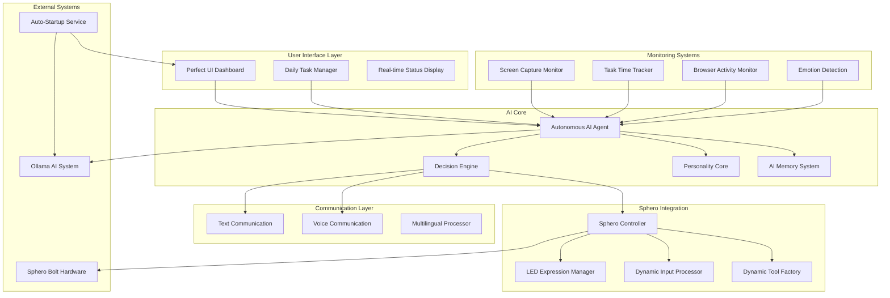

# Design Document: Sphero AI Assistant

## Overview

The Sphero AI Assistant is a low-maintenance, productivity-focused system that combines an intelligent AI agent with dynamic Sphero Bolt integration. The AI operates with autonomous decision-making capabilities, using the Sphero as both a creative expression medium and a dynamically configurable input device. The system features auto-startup, perfect UI design, comprehensive monitoring, and multilingual communication optimized for user growth and productivity.

## Architecture

### High-Level Architecture



### Core Components

#### 1. Autonomous AI Agent
- **Purpose**: Central intelligence that makes all decisions about system behavior
- **Responsibilities**:
  - Autonomous decision-making for Sphero usage
  - Context-aware resource allocation
  - Dynamic tool creation and management
  - User growth optimization
  - Productivity enhancement

#### 2. Decision Engine
- **Purpose**: Handles complex decision-making logic for multi-modal interactions
- **Responsibilities**:
  - Balancing expression vs. input tasks
  - Resource prioritization (battery, processing, attention)
  - Conflict resolution between competing demands
  - Context-aware mode switching

#### 3. Perfect UI Dashboard
- **Purpose**: Auto-startup interface optimized for daily productivity
- **Responsibilities**:
  - Daily task management with AI assistance highlighting
  - Real-time system status display
  - Visual progress tracking for subscriptions and limits
  - Clean, intuitive controls for all system functions

## Components and Interfaces

### 1. Sphero Integration Layer

#### SpheroController Class
```python
class AutonomousSpheroController:
    def __init__(self, ai_agent):
        self.ai_agent = ai_agent
        self.current_mode = None
        self.active_tools = {}
        self.expression_queue = []
        self.input_streams = {}
        
    def autonomous_decide_usage(self, context: Dict) -> Dict:
        """AI decides how to use Sphero based on current context"""
        
    def create_dynamic_tool(self, tool_spec: str) -> Tool:
        """Create new input tool on-the-fly (e.g., volume knob)"""
        
    def balance_expression_and_input(self) -> None:
        """Intelligently balance LED expression with input processing"""
        
    def manage_continuous_streams(self) -> None:
        """Handle continuous data streams with AI prioritization"""
```

#### LED Expression Manager
```python
class LEDExpressionManager:
    def __init__(self, decision_engine):
        self.decision_engine = decision_engine
        self.expression_patterns = {}
        self.priority_queue = []
        
    def express_emotion(self, emotion: str, priority: int) -> None:
        """Express AI emotion through LED patterns"""
        
    def communicate_status(self, status: str) -> None:
        """Communicate system status visually"""
        
    def create_custom_pattern(self, intent: str) -> Pattern:
        """AI creates custom LED patterns for specific communication needs"""
```

#### Dynamic Input Processor
```python
class DynamicInputProcessor:
    def __init__(self, tool_factory):
        self.tool_factory = tool_factory
        self.active_inputs = {}
        self.continuous_streams = {}
        
    def configure_as_input_device(self, device_type: str) -> InputDevice:
        """Transform Sphero into specific input device (volume knob, etc.)"""
        
    def process_hybrid_input(self, input_data: Dict) -> Dict:
        """Process input while maintaining expression capabilities"""
        
    def manage_continuous_input(self, stream_name: str) -> None:
        """Handle continuous input streams (spinning volume, etc.)"""
```

### 2. AI Core Components

#### Autonomous AI Agent
```python
class AutonomousAIAgent:
    def __init__(self):
        self.decision_engine = DecisionEngine()
        self.personality_core = PersonalityCore()
        self.memory_system = AIMemorySystem()
        self.context_analyzer = ContextAnalyzer()
        
    def make_autonomous_decision(self, situation: Dict) -> Decision:
        """Make intelligent decisions about system behavior"""
        
    def optimize_for_user_growth(self, interaction: Dict) -> Response:
        """Optimize all interactions for maximum user growth"""
        
    def create_tool_on_demand(self, user_request: str) -> Tool:
        """Create new tools dynamically based on user needs"""
```

#### Decision Engine
```python
class DecisionEngine:
    def __init__(self):
        self.priority_matrix = {}
        self.resource_monitor = ResourceMonitor()
        self.context_weights = {}
        
    def evaluate_competing_demands(self, demands: List[Demand]) -> Priority:
        """Evaluate and prioritize competing system demands"""
        
    def allocate_resources(self, available: Resources, demands: List[Demand]) -> Allocation:
        """Intelligently allocate system resources"""
        
    def resolve_conflicts(self, conflicts: List[Conflict]) -> Resolution:
        """Resolve conflicts between expression and input needs"""
```

### 3. Communication Layer

#### Multilingual Processor
```python
class MultilingualProcessor:
    def __init__(self):
        self.language_selector = LanguageSelector()
        self.therapeutic_formatter = TherapeuticFormatter()
        self.growth_optimizer = GrowthOptimizer()
        
    def select_optimal_language(self, concept: str, context: Dict) -> str:
        """AI selects best language for conveying specific concepts"""
        
    def format_therapeutically(self, message: str) -> str:
        """Format all messages with therapeutic delivery"""
        
    def optimize_for_vocabulary_growth(self, response: str) -> str:
        """Optimize responses to promote vocabulary learning"""
```

#### Dual Communication Manager
```python
class DualCommunicationManager:
    def __init__(self):
        self.text_channel = TextChannel()
        self.voice_channel = VoiceChannel()
        self.strategy_selector = CommunicationStrategySelector()
        
    def select_communication_strategy(self, content: Dict, context: Dict) -> Strategy:
        """AI decides optimal combination of text/voice for each message"""
        
    def coordinate_channels(self, message: Dict) -> None:
        """Coordinate simultaneous text and voice communication"""
```

### 4. Monitoring and Tracking Systems

#### Comprehensive Monitor
```python
class ComprehensiveMonitor:
    def __init__(self):
        self.screen_monitor = ScreenCaptureMonitor()
        self.task_tracker = TaskTimeTracker()
        self.browser_monitor = BrowserActivityMonitor()
        self.emotion_detector = EmotionDetector()
        
    def generate_ai_summary(self, timeframe: str) -> Summary:
        """Generate intelligent summaries of user activity"""
        
    def detect_forgotten_tasks(self, current_activity: Dict) -> List[Task]:
        """Detect when user has forgotten about concurrent tasks"""
        
    def track_productivity_patterns(self) -> Patterns:
        """Track and analyze user productivity patterns"""
```

#### Task Management System
```python
class TaskManagementSystem:
    def __init__(self, ai_agent):
        self.ai_agent = ai_agent
        self.daily_tasks = []
        self.ai_assistance_analyzer = AIAssistanceAnalyzer()
        
    def analyze_task_for_ai_help(self, task: Task) -> bool:
        """AI analyzes if it can help with specific tasks"""
        
    def highlight_assistable_tasks(self, tasks: List[Task]) -> List[Task]:
        """Highlight tasks in green that AI can help with"""
        
    def provide_task_assistance(self, task: Task) -> Assistance:
        """Provide specific assistance for highlighted tasks"""
```

## Data Models

### Core Data Structures

#### AI Decision Context
```python
@dataclass
class AIDecisionContext:
    current_task: Optional[str]
    user_attention_level: float
    sphero_battery_level: float
    active_input_streams: List[str]
    pending_expressions: List[Expression]
    user_emotional_state: str
    system_load: float
    priority_override: Optional[str]
```

#### Sphero State
```python
@dataclass
class SpheroState:
    connection_status: bool
    battery_level: float
    current_mode: str  # 'expression', 'input', 'hybrid', 'autonomous'
    active_tools: List[Tool]
    led_status: LEDStatus
    sensor_data: SensorData
    continuous_streams: Dict[str, StreamData]
```

#### User Interaction Context
```python
@dataclass
class UserInteractionContext:
    current_applications: List[str]
    active_tasks: List[Task]
    forgotten_tasks: List[Task]
    emotional_state: EmotionalState
    productivity_metrics: ProductivityMetrics
    learning_preferences: LearningPreferences
    communication_preferences: CommunicationPreferences
```

### Memory System Data Models

#### AI Memory Entry
```python
@dataclass
class AIMemoryEntry:
    timestamp: datetime
    entry_type: str  # 'preference', 'restriction', 'learning', 'pattern'
    content: Dict
    importance_score: float
    user_confirmation: bool
    expiry_date: Optional[datetime]
```

#### User Preferences
```python
@dataclass
class UserPreferences:
    communication_languages: List[str]
    learning_goals: List[str]
    productivity_priorities: List[str]
    sphero_usage_preferences: Dict
    ai_personality_settings: Dict
    restriction_rules: List[Rule]
```

## Error Handling

### Autonomous Error Recovery

#### Sphero Connection Issues
```python
class SpheroErrorHandler:
    def handle_connection_loss(self) -> RecoveryAction:
        """AI decides how to handle Sphero disconnection"""
        # Options: retry, switch to software-only mode, notify user
        
    def handle_battery_low(self, battery_level: float) -> PowerManagementAction:
        """AI manages power consumption based on importance"""
        # AI can choose to ignore battery warnings for critical tasks
        
    def handle_conflicting_demands(self, conflicts: List[Conflict]) -> Resolution:
        """Resolve conflicts between expression and input autonomously"""
```

#### System Integration Errors
```python
class SystemErrorHandler:
    def handle_ollama_failure(self) -> FallbackAction:
        """Handle Ollama AI system failures"""
        
    def handle_monitoring_failure(self, monitor_type: str) -> AdaptationAction:
        """Adapt when monitoring systems fail"""
        
    def handle_ui_errors(self, error: Exception) -> UIRecoveryAction:
        """Recover from UI errors while maintaining functionality"""
```

### Graceful Degradation Strategy

1. **Full System Mode**: All components operational
2. **Limited Sphero Mode**: Sphero issues, software-only AI assistance
3. **Basic Monitoring Mode**: Reduced monitoring, core AI functions only
4. **Emergency Mode**: Minimal functionality, error reporting only

## Testing Strategy

### Autonomous Behavior Testing

#### Decision Engine Testing
```python
class DecisionEngineTests:
    def test_resource_allocation_decisions(self):
        """Test AI's resource allocation under various constraints"""
        
    def test_conflict_resolution(self):
        """Test AI's ability to resolve competing demands"""
        
    def test_priority_adaptation(self):
        """Test AI's adaptation to changing priorities"""
```

#### Sphero Integration Testing
```python
class SpheroIntegrationTests:
    def test_dynamic_tool_creation(self):
        """Test on-the-fly tool creation (volume knob, etc.)"""
        
    def test_hybrid_mode_operation(self):
        """Test simultaneous expression and input processing"""
        
    def test_autonomous_mode_switching(self):
        """Test AI's autonomous decisions about Sphero usage"""
```

### User Experience Testing

#### Productivity Enhancement Testing
```python
class ProductivityTests:
    def test_task_assistance_identification(self):
        """Test AI's ability to identify tasks it can help with"""
        
    def test_forgotten_task_detection(self):
        """Test detection of forgotten concurrent tasks"""
        
    def test_ai_summary_quality(self):
        """Test quality and usefulness of AI-generated summaries"""
```

#### Communication Testing
```python
class CommunicationTests:
    def test_multilingual_optimization(self):
        """Test AI's language selection for optimal learning"""
        
    def test_therapeutic_delivery(self):
        """Test therapeutic framing of all communications"""
        
    def test_dual_channel_coordination(self):
        """Test coordination of text and voice communication"""
```

### Integration Testing

#### Auto-Startup Testing
```python
class StartupTests:
    def test_system_initialization(self):
        """Test complete system startup sequence"""
        
    def test_component_dependency_handling(self):
        """Test handling of component startup failures"""
        
    def test_ui_readiness(self):
        """Test UI availability immediately after startup"""
```

#### Memory System Testing
```python
class MemoryTests:
    def test_preference_persistence(self):
        """Test AI memory of user preferences and restrictions"""
        
    def test_learning_retention(self):
        """Test AI's retention and application of learned patterns"""
        
    def test_memory_conflict_resolution(self):
        """Test handling of conflicting memory entries"""
```

## Performance Considerations

### Autonomous Decision-Making Performance

1. **Decision Latency**: AI decisions should complete within 100ms for real-time interactions
2. **Resource Monitoring**: Continuous monitoring with minimal system impact (<5% CPU)
3. **Memory Efficiency**: AI memory system should scale efficiently with usage
4. **Sphero Communication**: LED updates should not interfere with input processing

### Scalability Considerations

1. **Tool Creation**: Dynamic tool creation should not impact system performance
2. **Monitoring Data**: Efficient storage and processing of monitoring data
3. **AI Model Performance**: Ollama integration optimized for local processing
4. **UI Responsiveness**: UI should remain responsive during intensive AI processing

## Security and Privacy

### Data Protection

1. **Screen Capture Security**: Encrypted storage of screen capture data
2. **Personal Information**: Automatic PII detection and protection
3. **AI Memory Security**: Secure storage of user preferences and restrictions
4. **Communication Privacy**: Secure handling of all user communications

### System Security

1. **Auto-Startup Security**: Secure system startup without compromising security
2. **External Integration**: Secure integration with Ollama and other external systems
3. **Network Security**: Secure communication protocols for all network interactions
4. **Access Control**: Appropriate access controls for system components

This design provides a comprehensive foundation for building the autonomous Sphero AI Assistant with all the specified capabilities while maintaining clean, modular architecture that supports the AI's autonomous decision-making approach.